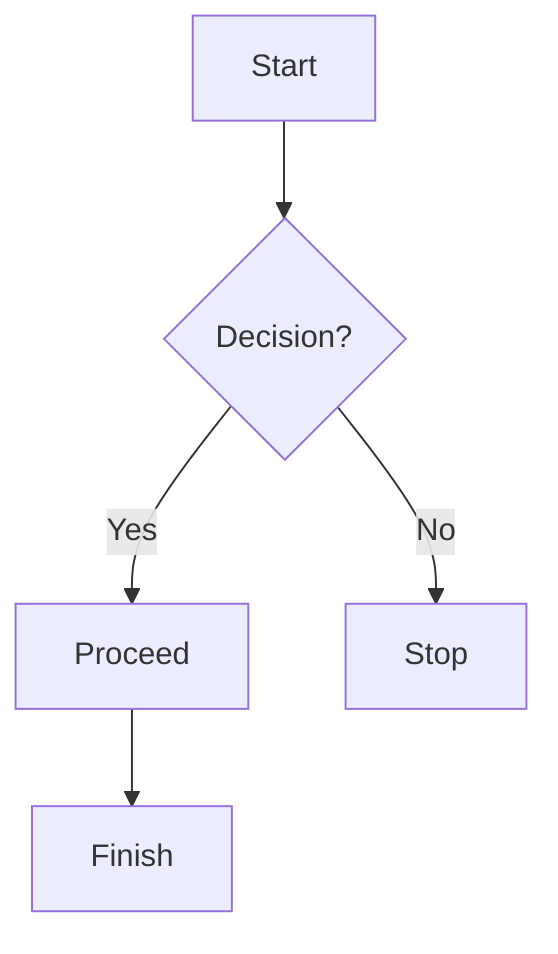

# Mermaid Live Editor

A web-based live editor for creating and previewing Mermaid diagrams in real-time. This tool allows you to write Mermaid syntax and instantly see the rendered diagrams.

## Features

- 🎨 Real-time diagram preview
- 🌈 Multiple theme options (Default, Dark, Forest, Neutral, Base, Night)
- 💾 Download functionality for diagrams
- 📝 User-friendly text editor
- 🔄 Instant rendering
- 📱 Responsive design

## Getting Started

### Prerequisites

No installation required! Just open `index.html` in your web browser.

### Usage

1. Open the editor in your web browser
2. Write your Mermaid diagram syntax in the left panel
3. See the rendered diagram instantly in the right panel
4. Choose from different themes using the theme buttons
5. Download your diagram using the download button

## Example

The editor comes with a default flowchart example:

## Technologies Used

- HTML5
- CSS3
- JavaScript
- [Mermaid.js](https://mermaid.js.org/)

## License

This project is open source and available under the MIT License.

## Contributing

Contributions are welcome! Feel free to submit a Pull Request. 